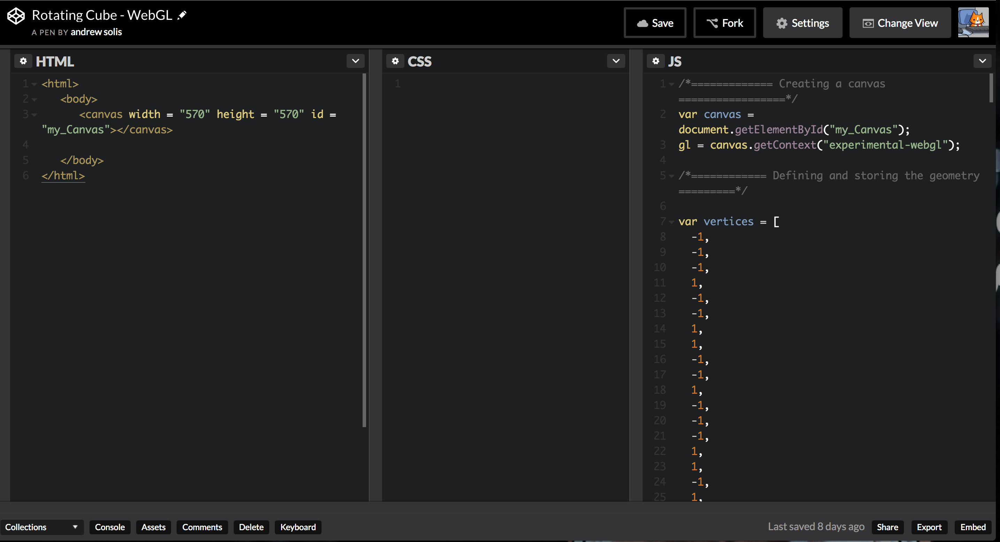
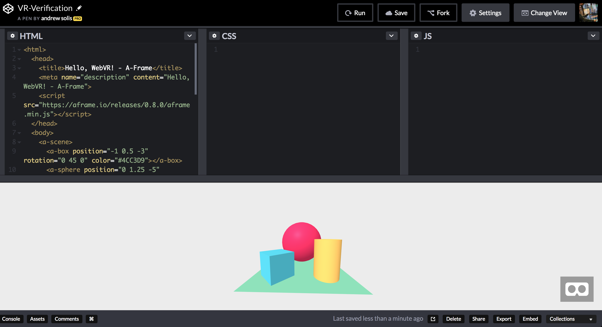
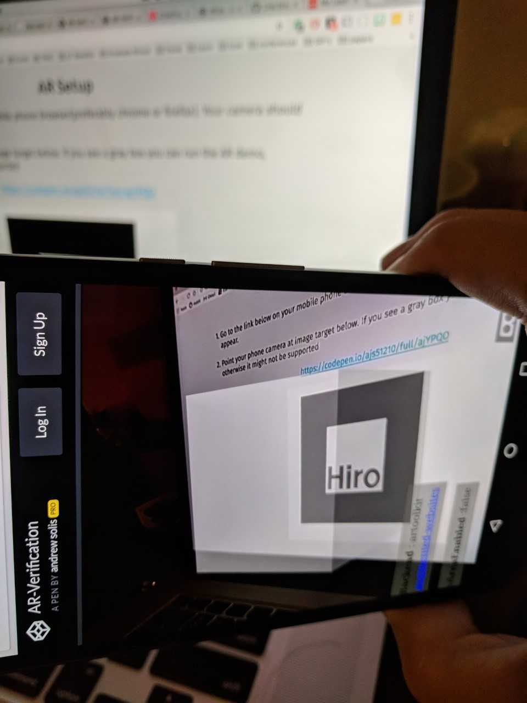
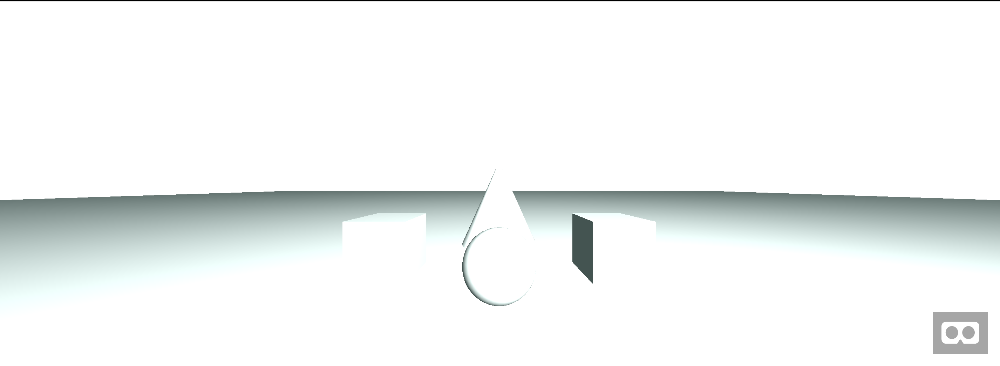

<!-- Title slide. -->

<!-- .slide: data-background="media/img/TACC_Slide.png" class="dark-text center" -->
#A-Frame: Hand-on Tutorial

https://andrewsolis.github.io/aframe-school/#/

<!-- NOTES -->
- Uses A-Frame school outline, but recreated to be more welcoming
    to scientific visualization
- Open the link at the bottom to follow yourself. You arrow keys 
    to move through the presentation.
- Go at your own pace and if you have any questions or need help
    please let us know!
- What do you need to begin?

------

## Resources

* [A-frame documentation](https://aframe.io/docs) open for reference
* [Codepen.io](https://codepen.io/) account to host your demo project
* Web browser (preferably [Chrome](https://www.google.com/chrome/))
* [Hiro Image Target](https://github.com/jeromeetienne/AR.js/blob/master/data/images/HIRO.jpg) (if doing AR examples)
* laptop or mobile phone

---

## Codepen.io

> [Codepen.io](https://codepen.io/) is an online resource for testing and showcasing
> code snippets for content for the web.

- Codepen let's you type up and run your code in the browser
- You can see your changes and the results of your code
---

## VR or AR

> We will be showing how to perform the same examples for both AR and VR. Please choose
    the one you would like to use. If you are doing VR your laptop is enough. If you are doing AR follow the instructions after the VR instruction...

<!-- NOTES -->
* Each example will have an AR and VR example. Please choose whichever you'd like, but stick
    with one if you can.

---

## VR Setup

> Open up the Codepen demo at the link provided. You should see a scene similar to the one 
    below. Your view into your virtual scene will be at the bottom. You can use your mouse to look around, and the arrow keys or W, A, S, and D keys to move around the scene. 

https://codepen.io/ajs51210/pen/OwvrKZ

---

## AR Setup

1.  Go to the link below on your mobile phone browser(preferably chrome). Your camera should open. 

2. Point your phone camera at image target below. If you see a gray box you can run the AR 
    demo, otherwise it might not be supported

https://codepen.io/ajs51210/full/ajYPQO

<!-- NOTES -->
* If it doesn't work right away you can spend a few minutes debugging, but please don't spend too much time otherwise it might not work and you won't be able to follow the rest of the examples

---

## AR Setup (Verification)

---

AR Setup (Hiro Image Target)

https://tinyurl.com/y7e4zyep

<!-- NOTES -->
* We have a printout of the image target if you'd like to use the paper instead of your laptop, either will work
* This image target is used for the ar demos as a way to trigger an object to appear on  top of the image
* There is a link at the bottom of this page to the image target that you can keep open on your laptop if you prefer this over the paper
---

## Codepen Links

  <a class="cta-button codepen" target="_blank">View AR Lesson</a>  

  <a class="cta-button codepen" target="_blank">View VR Lesson</a>  

<!-- NOTES -->
* Examples will have links for both AR and VR demos
* Please select the one you wish to do, but try and stick
    with one.

------
## HTML [3]

**H**yper**T**ext **M**arkup **Language**

* It is NOT a programming language
* it IS a _markup language_

<!-- NOTES -->
* How many of you have done any web development? How many know what XML is? It is similar in style but different
    in implementation
* Tells the browser how to structure the webpage
* Follows the same paradigm as XML, however XML describes objects, whereas HTML describes the pages layout
* Uses tags to enclose, wrap, or mark up parts of the content to appear in a certain way
---

  

<!-- NOTES -->
* Opening Tag: name of the element and where the element begins
* Closing Tag: where the element ends
* Content: Content of the element ( in this example text )
* element: Opening tag, Closing Tag, content

---

## Nesting Elements

<pre class="code-good"> <code class="html code-good">
 It's a great <strong>big</strong> world 

</code> </pre>

<pre class="code-bad"> <code class="html code-bad">
It's a great <strong>big world
</strong>
</code></pre>

<!-- NOTES -->
 - Putting elements inside of other elements by including tags
 - Make sure tags open and close correctly. Close the most recent tag and so on...
---

## Attributes

  

<!-- NOTES -->
* contain information about element you do not want to appear in the actual content
* All attributes should have a space between it and the element name or previous attribute
* It is the attribute name followed by an equals sign
* An attribute vale with opening and closing quotes (single or double)
* If you understand all of these then you can understand how to use A-Frame

------

## Start with *Hello, WebVR*

> A-Frame provides easy-to-use HTML elements for starters called 
[primitives](https://aframe.io/docs). In the sections below,
we'll modify basic meshes through HTML attributes (e.g., change colors,
positions, rotations, scale) and get a feel for the workflow.

---

## Start with *Hello, WebVR* &mdash; Position

> Position defines where objects are in 3D space (X, Y, Z) in meters. Change
> the `position` of the objects via the `position` HTML attribute values. [Read about
> positions](https://aframe.io/docs/master/components/position.html).

> 1 unit = 1 meter(AR = 1 cm)

  <a class="cta-button codepen" href="https://codepen.io/ajs51210/pen/MBVPjW" target="_blank">AR Lesson</a>  

  <a class="cta-button codepen" href="https://codepen.io/ajs51210/pen/GBxwbZ" target="_blank">VR Lesson</a>  

1. Move the cylinder left by *decreasing* the `position`'s X value
2. Move the box up by *increasing * the `position`'s Y value
3. Move the sphere back by *decreasing* the `position`'s Z value
4. **Extra Credit:** Add `<a-ring>` as a child of `<a-sphere>` and give it a position to see relative positions

  
  

---

## Start with *Hello, WebVR* &mdash; Rotation

> Rotation defines orientation of objects in 3D space (about the X, Y, Z axes)
> in degrees. Use the right-hand rule to spatially visualize rotation. [Read about
> rotations](https://aframe.io/docs/master/components/rotation.html).

> Rotation coordinate system: "x, y, z"

1. Rotate the cylinder around the X axis so we see the bottom
2. Rotate the box around the Y axis so the box is facing straight
3. **Extra Credit:** Wrap the scene contents in `<a-entity>` (like a `
`)
and give it a rotation to see relative rotations

---

## Start with *Hello, WebVR* &mdash; Add Primitives

> Add primitives the scene by adding HTML elements under `<a-scene>`.  [Read
> about primitives](https://aframe.io/docs).

1. Add [`<a-torus-knot>`](https://aframe.io/docs/0.8.0/primitives/a-torus-knot.html) to the left
2. Add [`<a-dodecahedron>`](https://aframe.io/docs/0.8.0/primitives/a-dodecahedron.html) to the right
3. Add [`<a-text>`](https://aframe.io/docs/0.8.0/primitives/a-text.html) aligned in the center

  <a class="cta-button codepen" href="https://codepen.io/ajs51210/pen/pZLYee" target="_blank">AR Result</a>  

  <a class="cta-button codepen" href="https://codepen.io/ajs51210/pen/MBVxep" target="_blank">VR Result</a>  

------

## Loading Objects

> We'll be loading in a DNA in OBJ format into our scene. The code has been setup so the object is already available, you 
> just need to figure out how to load it and place it in the scene.

---

## Add Textures &mdash; Uploading Assets

> We'll be adding image textures to meshes to more appearance than a flat color.
> [Find your own images
> online](https://aframe.io/docs/0.8.0/introduction/faq.html#where-can-i-find-assets),
> and upload them through the assets section in Glitch or through the uploader on
> [cdn.aframe.io](https://cdn.aframe.io) or [Cloudinary](http://cloudinary.com/). Wherever else you may upload, make sure
> it's being served with
> [CORS](https://developer.mozilla.org/docs/Web/HTTP/Access_control_CORS) and
> over HTTPS.

In the Glitch below **&darr;**, some assets will already be provided in the
assets section (pictured above).

---

## Add Textures &mdash; Image Textures

> Fill in the `src` HTML attributes with image URLs. [Read about applying an
> image texture](https://aframe.io/docs/0.8.0/guides/building-a-basic-scene.html#applying-an-image-texture).

  <a class="cta-button glitch" href="https://glitch.com/~aframe-school-textures/" target="_blank">Remix Lesson on Glitch</a>  

  <a class="cta-button codepen" href="https://codepen.io/ajs51210/pen/XgRpzJ" target="_blank">Fork Lesson on Codepen</a>  

1. Add an image texture to the ground, `<a-plane>`
2. Add image textures to `<a-box>`es
3. Add an image texture to `<a-sphere>`
4. Add an image texture to `<a-cone>`
5. Add an image texture to the background, `<a-sky>`. Find [360&deg; images from FLickr](https://www.flickr.com/groups/equirectangular/)

<a href="https://aframe-school-textures.glitch.me/solution.html" target="_blank">View Result</a>  <!-- .element: class="cta-button" -->

---

* Sky: https://cdn.glitch.com/b870d9ec-1139-44f9-b462-223e4a2c74e7%2Fsechelt.jpg?1490307995926
* Box: https://cdn.glitch.com/b870d9ec-1139-44f9-b462-223e4a2c74e7%2Ftexture.jpg?1490308149272
* sphere: https://cdn.glitch.com/b870d9ec-1139-44f9-b462-223e4a2c74e7%2Fcubes.jpg?1490308405745
* cone: https://cdn.glitch.com/b870d9ec-1139-44f9-b462-223e4a2c74e7%2Fcone.jpg?1490308535937
* Box: https://cdn.glitch.com/b870d9ec-1139-44f9-b462-223e4a2c74e7%2Fdirt.jpg?1490308269805
* plane: https://cdn.glitch.com/b870d9ec-1139-44f9-b462-223e4a2c74e7%2Ffloor.jpg?1490307896453
------

## Open the A-Frame Inspector

> Hit **`<ctrl> + <alt> + i`** on **any** A-Frame scene to pop open a visual
> editor, just like your browser's Dev Tools!  Try the Inspector on some of the
> [homepage examples](https://aframe.io/examples/). [Read about the
> Inspector](https://aframe.io/docs/master/guides/using-the-aframe-inspector.html).

---

## Open the A-Frame Inspector &mdash; Change Component Values

> Modify an entity by modifying its components on the right-hand panel. The
> Inspector knows about all A-Frame components, including community components.
>  This example includes an external [text-geometry
> component](https://www.npmjs.com/package/aframe-text-geometry-component), which
> the Inspector can modify the values of live.

  <a class="cta-button glitch" href="https://aframe-vaporwave.glitch.me" target="_blank">Open Example on Glitch</a>  

  <a class="cta-button codepen" href="https://codepen.io/ajs51210/pen/dRWvLw" target="_blank">Open Example on Codepen</a>  

1. Select one of the entities with text in the example
2. Change the [`text-geometry` component's](https://www.npmjs.com/package/aframe-text-geometry-component) `value` property

---

## Open the A-Frame Inspector &mdash; Attach Components from the Registry

> Use [physics components](https://github.com/donmccurdy/aframe-physics-system)
> from the [Registry](https://aframe.io/registry/) to add gravity and collisions.
> The Registry is a curated collection of A-Frame components. And the Inspector
> is hooked up to the Registry so we can add components from the Registry in the
> entity panel.

1. Add the `static-body` component to ground grid
2. Add the `dynamic-body` component to the torus knot (the purple pretzel in the back)
3. Increase the Y-position of the torus knot to make it higher up
4. Exit the Inspector

------

## Compose with Entity-Component &mdash; Break Primitives Down

> Behind the easy-to-use primitive elements, A-Frame is based on an
> entity-component architecture. Decompose the primitive elements in the
> *Hello, WebVR* example to `<a-entity>`s with their fundamental components.

  <a class="cta-button glitch" href="https://glitch.com/~aframe-school-ecs" target="_blank">Remix Lesson on Glitch</a>  

  <a class="cta-button codepen" href="https://codepen.io/ajs51210/pen/xrddZy" target="_blank">Fork Lesson on Codepen</a>  

[geometry]: https://aframe.io/docs/0.8.0/components/geometry.html
[material]: https://aframe.io/docs/0.8.0/components/material.html

1. Convert `<a-box>` to `<a-entity>` with [geometry component][geometry] and [material component][material]. Configure the geometry component to be `primitive: box`
2. Convert `<a-sphere>` to `<a-entity>` with geometry component and material component. Configure the geometry component to be `primitive: sphere`
3. Convert `<a-cylinder>` to `<a-entity>` with geometry component and material component. Configure the geometry component to be `primitive: cylinder`
4. Convert `<a-plane>` to `<a-entity>` with geometry component and material component. Configure the geometry component to be `primitive: plane`
5. Convert `<a-sky>` to `<a-entity>` with geometry component and material component. Configure the geometry component to be `primitive: sphere` with a large `radius: 3000`, and configure the material component to be `shader: flat` so we don't do expensive lighting calculations when we just need a flat color

<a href="https://aframe-school-ecs.glitch.me/solution.html" target="_blank">View Result</a>  <!-- .element: class="cta-button" -->

---

## Compose with Entity-Component &mdash; Add a Light Source Sphere

> Use the entity-component pattern to add a sphere that also acts as a point
> light source. Mix together the geometry, material, and light components to
> compose this type of object.

1. Look for `<a-entity id="lightSphere">`
2. Attach the [geometry component](https://aframe.io/docs/0.8.0/components/geometry.html) configured to use `primitive: sphere` to the entity
3. Attach the [material component](https://aframe.io/docs/0.8.0/components/material.html) configured to use `color: #FFF` and `shader: flat` to the entity
4. Attach the [light component](https://aframe.io/docs/0.8.0/components/light.html) configured to use `type: point` to the entity
5. **Extra Credit:** Add the animation component from [the Registry](https://aframe.io/registry/) via a `<script>' tag. Attach the animation configured to use `property: position` and `dir: alternate` and `loop: true` and provide a position value for `to: <POSITION>`

  <a class="cta-button glitch" href="https://glitch.com/~aframe-school-ecs-light-sphere" target="_blank">Remix Lesson on Glitch</a>  

  <a class="cta-button codepen" href="https://codepen.io/ajs51210/pen/gRWWmP" target="_blank">Fork Lesson on Codepen</a>  

>

<a href="https://aframe-school-ecs-light-sphere.glitch.me/solution.html" target="_blank">View Result</a>  <!-- .element class="cta-button" -->

------

## Extend with Entity-Component &mdash; From the Registry

> [The Registry](https://aframe.io/registry/) is a great place to grab cool
> components that the community has added to A-Frame. Sort of like third-party
> plugins. Find community components from the Registry, copy their JS links,
> include them via a `<script>` tag, and use them straight from HTML.

1. Include [Particle
System](https://www.npmjs.com/package/aframe-particle-system-component). Attach
`<a-entity>`s with `particle-system` components configured to `preset: default`
and `preset: snow`. Open the Inspector to play with the values!
2. Include [Animation](https://www.npmjs.com/package/aframe-animation-component). Attach
animation to the sphere to throb its scale by configuring `animation` component
with `property: scale`, `loop: true`, and `to: 1.1 1.1 1.1`
3. Include [Outline Effect](https://www.npmjs.com/package/aframe-outline-effect). Drop in the
`<script>` and attach the `outline` component to the scene

  <a class="cta-button glitch" href="https://glitch.com/~aframe-school-registry" target="_blank">Remix Lesson on Glitch</a>  

  <a class="cta-button codepen" href="https://codepen.io/ajs51210/pen/vZmmpO" target="_blank">Fork Lesson on Codepen</a>  

<a href="https://aframe-school-registry.glitch.me/solution.html" target="_blank">View Result</a>  <!-- .element class="cta-button" -->

------

## Use JavaScript

> Use JavaScript and DOM APIs to programmatically modify the scene and its
> entities. A-Frame is not just HTML; A-Frame provides access to JavaScript,
> DOM APIs, and three.js underneath for full control.  [Read about *Using
> JavaScript and DOM APIs* with
> A-Frame](https://aframe.io/docs/0.8.0/guides/using-javascript-and-dom-apis.html).

  <a class="cta-button glitch" href="https://glitch.com/~aframe-school-js" target="_blank">Remix Lesson on Glitch</a>  

  <a class="cta-button codepen" href="https://codepen.io/ajs51210/pen/KqmvvV" target="_blank">Fork Lesson on Codepen</a>  

To see JavaScript logs, we can open the browser's development console by
right-clicking the page, clicking *Inspect* or *Inspect Element*, and then
clicking the *Console* tab. When viewing solutions, we can see the results
through the browser console.

---

## Use JavaScript &mdash; Getting Entities

> Use
> [`document.querySelector()`](https://developer.mozilla.org/docs/Web/API/Document/querySelector)
> and
> [`document.querySelectorAll()`](https://developer.mozilla.org/docs/Web/API/Document/querySelectorAll)
> to get a reference to the scene and its entities.  [Read about querying for
> entities](https://aframe.io/docs/0.8.0/guides/using-javascript-and-dom-apis.html#getting-entities-by-querying-and-traversing).

  <a class="cta-button glitch" href="https://glitch.com/~aframe-school-js" target="_blank">Remix Lesson on Glitch</a>  

  <a class="cta-button codepen" href="https://codepen.io/ajs51210/pen/KqmvvV" target="_blank">Fork Lesson on Codepen</a>  

1. Get a reference to the `<a-scene>` element using `var sceneEl = document.querySelector('a-scene');`
2. Get a reference to all `<a-entity>` elements using `sceneEl.querySelectorAll('a-entity');`
3. Get a reference to the box entity using `sceneEl.querySelector('#box');`
4. Get a reference to the sphere and cylinder entities in one `.querySelectorAll()` call by using multi-element selector
. Get a reference to the sphere and cylinder entities in one `.querySelectorAll()` call by adding and selecting HTML classes

<a href="https://aframe-school-js.glitch.me/solution.html" target="_blank">View Result</a>  <!-- .element: class="cta-button" -->

---

## Use JavaScript &mdash; Modifying Entities

> Use
> [`Entity.setAttribute()`](https://aframe.io/docs/0.8.0/core/entity.html#setattribute-attr-value-componentattrvalue)
> to modify entities after retrieving them from the previous exercise. [Read
> about modifying
> entities](https://aframe.io/docs/0.8.0/guides/using-javascript-and-dom-apis.html#modifying-an-entity).

  <a class="cta-button glitch" href="https://glitch.com/~aframe-school-js" target="_blank">Remix Lesson on Glitch</a>  

  <a class="cta-button codepen" href="https://codepen.io/ajs51210/pen/KqmvvV" target="_blank">Fork Lesson on Codepen</a>  

1. Change the box entity's `rotation` component
2. Change the cylinder entity's `geometry` component's `height` property
3. Change the sphere entity's `material` component's `metalness` property

<a href="https://aframe-school-js.glitch.me/solution2.html" target="_blank">View Result</a>  <!-- .element: class="cta-button" -->

---

## Use JavaScript &mdash; Creating Entities

> Use [`document.createElement()`](https://developer.mozilla.org/docs/Web/API/Document/createElement)
> to create entities, `.setAttribute()` to configure them, and `.appendChild()`
> to add them to the scene.  [Read about creating
> entities](https://aframe.io/docs/0.8.0/guides/using-javascript-and-dom-apis.html#creating-an-entity-with-createelement).

  <a class="cta-button glitch" href="https://glitch.com/~aframe-school-js" target="_blank">Remix Lesson on Glitch</a>  

  <a class="cta-button codepen" href="https://codepen.io/ajs51210/pen/KqmvvV" target="_blank">Fork Lesson on Codepen</a>  

1. In a JavaScript `for` loop, create and add 50 `<a-box>` elements with
random positions and scales (use `Math.random()`)

<a href="https://aframe-school-js.glitch.me/solution3.html" target="_blank">View Result</a>  <!-- .element: class="cta-button" -->

---

## Use JavaScript &mdash; Handling Events

> Use
> [`.addEventListener()`](https://developer.mozilla.org/docs/Web/API/EventTarget/addEventListener)
> to register a handler function that will be called when an event is emitted.
> Then manually emit that event to see that handler function execute. Later we
> can use event listeners to change the scene based on user input or other
> events. [Read about events and event listeners with
> A-Frame](https://aframe.io/docs/0.8.0/guides/using-javascript-and-dom-apis.html#events-and-event-listeners).

  <a class="cta-button glitch" href="https://glitch.com/~aframe-school-js" target="_blank">Remix Lesson on Glitch</a>  

  <a class="cta-button codepen" href="https://codepen.io/ajs51210/pen/KqmvvV" target="_blank">Fork Lesson on Codepen</a>  

1. Register an event listener on the box to listen to the `foo` event. In the
   handler function, change the box's color
2. Emit the `foo` event with
[`Entity.emit()`](https://aframe.io/docs/0.8.0/core/entity.html#emit-name-detail-bubbles)
and see the box change its color

<a href="https://aframe-school-js.glitch.me/solution4.html" target="_blank">View Result</a>  <!-- .element: class="cta-button" -->

------

## Add Gaze-Based Cursor Interactions &mdash; Add Cursor Entity

> Use the gaze-based [`cursor`
> component](https://aframe.io/docs/0.8.0/components/cursor.html) to provide
> the ability to interact with entities (primarily for smartphones).  [Read
> about building a 360&deg; image
> gallery](https://aframe.io/docs/0.8.0/guides/building-with-components.html).

  <a class="cta-button glitch" href="https://glitch.com/~aframe-school-cursor" target="_blank">Remix Lesson on Glitch</a>  

  <a class="cta-button codepen" href="https://codepen.io/ajs51210/pen/pwPrab" target="_blank">Fork Lesson on Codepen</a>  

This lesson has all the event listeners hooked up already. We just need to add
an entity with the `cursor` component which will provide those events based on
user input.  Note these events are not provided by the browser, but through
A-Frame.

1. Add [`<a-camera>`](https://aframe.io/docs/0.8.0/components/camera.html) entity.
   Previously A-Frame was providing a default camera
2. Add [`<a-cursor>`](https://aframe.io/docs/0.8.0/components/cursor.html) entity
   as a child underneath the camera entity
3. Drag the camera around the click on the panels on desktop. On smartphones,
   stare at the panels to trigger clicks (i.e., gaze-based)

<a href="https://aframe-school-cursor.glitch.me/solution.html" target="_blank">View Result</a>  <!-- .element: class="cta-button glitch" -->

---

## Add Gaze-Based Cursor Interactions &mdash; Handle Events

> Use the `click`, `mouseenter`, `mouseleave` events provided by the gaze-based
> [`cursor` component](https://aframe.io/docs/0.8.0/components/cursor.html) to
> change the properties of an object.

The Glitch code will have the project structure set up. We can add JavaScript
code inside the `handle-events` component, marked by the code comments.

  <a class="cta-button glitch" href="https://glitch.com/~aframe-school-cursor-handler" target="_blank">Remix Lesson on Glitch</a>  

  <a class="cta-button codepen" href="https://codepen.io/ajs51210/pen/ZyKJxe" target="_blank">Fork Lesson on Codepen</a>  

1. Attach our `controller-event-handler` to the cubes. We can attach to all of them at once through the mixin
2. Add an event listener to change the box's color on `mouseenter` event
3. Add an event listener to restore the box's color on `mouseleave` event

<a href="https://aframe-school-cursor-handler.glitch.me/solution.html" target="_blank">View Result</a>  <!-- .element: class="cta-button glitch" -->

------

## Add 3D Models &mdash; glTF Model

> 3D models are like the images of 3D and VR applications, although a bit
> heavier. A 3D model is created beforehand in a 3D modeling program such as
> [Blender](https://www.blender.org/) and consists of vertices, textures,
> materials. We recommend using [glTF](https://github.com/KhronosGroup/glTF), a
> relatively new 3D file format standard tailored for the Web. glTF is like the
> JPG of 3D models.

  <a class="cta-button glitch" href="https://glitch.com/~aframe-school-gltf-model" target="_blank">Remix Lesson on Glitch</a>  

  <a class="cta-button codepen" href="https://codepen.io/ajs51210/pen/jwmLQr" target="_blank">Fork Lesson on Codepen</a>  

1. Add the `https://cdn.aframe.io/test-models/models/virtualcity/VC.gltf` to
the `<a-asset-item id="cityModel">`'s `src` attribute to preload the model
2. Add `#cityModel` to the `<a-gltf-model>`'s `src` attribute to set and add the model

<a href="https://aframe-school-gltf-model.glitch.me/solution.html" target="_blank">View Result</a>  <!-- .element: class="cta-button" -->

---

## Add 3D Models &mdash; glTF Model Animations

> Models can come with animations. The model provided above has many animations
> of ships zooming across the city. In the previous Glitch, we've provided a simple
> `play-all-model-animations` component that we can attach to our model to play
> its animations. Continue working from your current Glitch.

1. Include the `animation-mixer` component via a `<script>` in the
`<head>` after the A-Frame script. This component is currently in the Registry,
and may one day be included with A-Frame. `https://unpkg.com/aframe-extras.animation-mixer@3.4.0/dist/aframe-extras.animation-mixer.js`
2. Attach the `animation-mixer` component to the `<a-gltf-model>` by
setting it via an HTML attribute `animation-mixer`. By default, this will play all
the animations of the model at once.

<a href="https://aframe-school-gltf-model.glitch.me/solution2.html" target="_blank">View Result</a>  <!-- .element: class="cta-button" -->

---

## Add 3D Models &mdash; Uploading 3D Models

> If you have a model of your own, it can be tricky to upload it to a CDN since
> it consists of multiple files that reference each other. So far the easiest
> way we've found is to dump them into a GitHub repo, publish the repo's master
> branch to GitHub Pages, and use `rawgit.com` to serve them. Alternatively,
> set up Amazon S3. More to come.

------

## Add Tracked Controls &mdash; Add Hand Controls

> Tracked hand controls provide immersion and interactivity with hand
> controllers. In the following Glitch, we've pre-recorded hand control
> movements and button presses with [A-Frame Motion
> Capture](https://github.com/dmarcos/aframe-motion-capture-components).
> Now we just have to add the hands and handle the interaction events.

  <a class="cta-button glitch" href="https://glitch.com/~aframe-school-hand-controls" target="_blank">Remix Lesson on Glitch</a>  

  <a class="cta-button codepen" href="https://codepen.io/ajs51210/pen/KqmvLa" target="_blank">Fork Lesson on Codepen</a>  

1. Find `<a-entity id="left">` and add the [hand-controls component](https://aframe.io/docs/0.8.0/components/hand-controls.html)
configured to the left hand (`hand-controls="left"`)
2. Find `<a-entity id="right">` and add the hand-controls component
configured to the right hand (`hand-controls="right"`)
3. View the result and see the hands moving with pre-recorded motions

<a href="https://aframe-school-hand-controls.glitch.me/solution.html" target="_blank">View Result</a>  <!-- .element: class="cta-button" -->

---

## Add Tracked Controls &mdash; Add Interactivity

> There are many components to add interactivity to hand controls.
> [controller-cursor](https://github.com/bryik/aframe-controller-cursor-component),
> [aabb-collider +
> grab](https://github.com/aframevr/aframe/tree/master/examples/showcase/tracked-controls/components),
> [super-hands](https://github.com/wmurphyrd/aframe-super-hands-component). For
> this lesson, we'll use controller-cursor that acts as a pointing laser for
> each hand. Continue from your previous Glitch.

1. Add `controller-cursor` component to both hands
2. In the `controller-event-handler` component, change the color of the boxes
when they are hovered over with the `mouseenter` event, and restore the color
with the `mouseleave` event

<a href="https://aframe-school-hand-controls.glitch.me/solution2.html" target="_blank">View Result</a>  <!-- .element: class="cta-button" -->

------

<!-- Lessons end here. -->

## Congratulations!

You've graduated from the A-Frame School and now have a virtual uncertified
degree in WebVR.

Head to [the documentation](https://aframe.io/docs/) for more guides to become
a master.

------
# References

1. Kevin, Ngo, and Po-chiang Chao. "A-Frame School." _aframe.io_ Mozilla Corporation, n.d. Web. 19 June 2017. <https://aframe.io/aframe-school/#/>.

2. Matt, Vaughn. "CSHL A-frame." _Heroku_ TACC, n.d. Web. 19 June 2017. <http://cshl-aframe.kybernet.es/index.html#/1>.

3. "Getting Started with HTML." _Mozilla Developer Network_ Mozilla Corporation, n.d. Web. 19 June 2017. <https://developer.mozilla.org/en-US/docs/Learn/HTML/Introduction_to_HTML/Getting_started>.

4. Grumpy-cat-small. Digital image. _Mozilla Developer Network_ Mozilla Corporation, n.d. Web. 19 June 2017. <https://mdn.mozillademos.org/files/9347/grumpy-cat-small.png>.
